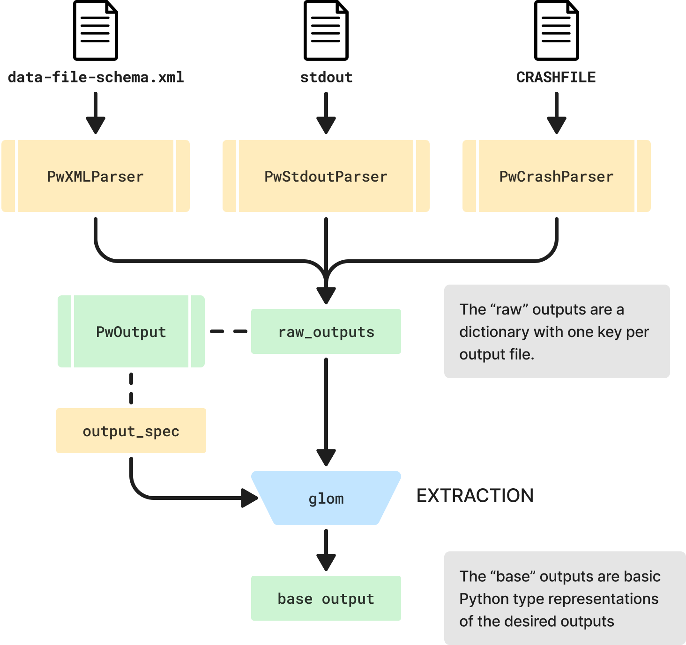
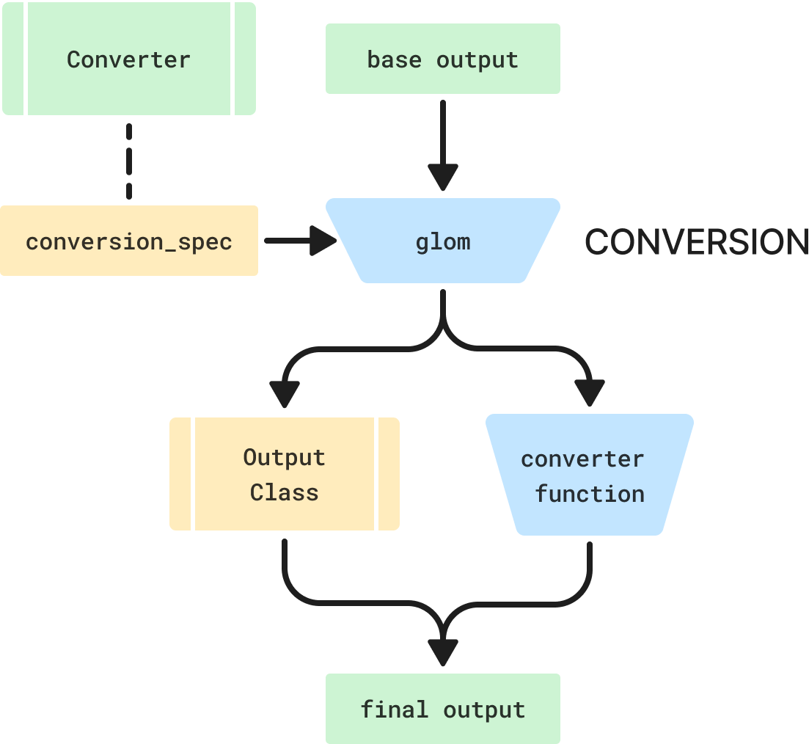

# Outputs

The main purpose of this package is to parse and convert the outputs of Quantum ESPRESSO calculations into Python types.
On this page we discuss the design of the parser functionality.

## Parsing
<br>


### One file, one parser class

All the logic related to parsing (or generating) a file should be stored on one class, with generic utility methods shared between parser classes.
The parser classes are implemented as stateless objects, which have to implement a single `parse`
method with the following signature:

```python
def parse(content: str):

    parsed_data: dict = ...
    return parsed_data
```

This make their usage and implementation very transparent. Moreover, it means we can
obtain the parsed data in a single step, e.g.:

```python
parsed_data = PwXMLParser.parse(content)
```

The abstract base class `BaseOutputFileParser` also implements a `parse_from_file` method that all parser classes can use:

```python
parsed_data = PwXMLParser.parse_from_file('qe_dir/pwscf.xml')
```

!!! note

    One motivation for having a stateful class might be performance: by storing the raw content on the class and only parsing it later, we can selectively parse what is needed.
    However, parsing the XML is most likely the most expensive operation we'll have to do here, in part because of the validation done by `xmlschema`.
    We're not sure if partially parsing the XML is an option, or we would lose the validation.
    There is also no performance bottleneck at this stage, even for larger XML files the parsing only takes 50 ms.

    Since the parser classes are not part of the public API at this point (see below), we can still come back on this point at a later date.
    Moreover, we can still keep the static methods in place, i.e. make changes to support partial parsing in a backwards-compatible manner.

!!! question "Should the file parser classes be part of the public API?"

    At first, I would have answered "yes" to this question.
    However, if a user can easily find the `pw.x` `stdout` parser, they might use it and then be rather disappointed with the result, since we _want_ to parse most outputs from the XML.

### One output object for each calculation

Parsing one file is typically not enough to get all the outputs of a calculation.
It would be useful to gather all of these into a single "output" object from which the user can access all data they are interested in.

```python
from qe_tools.outputs import PwOutput

qe_dir = '/Users/mbercx/project/qetools/data/qe_dir'

pw_out = PwOutput.from_dir(qe_dir)
pw_out.outputs
```

### Raw output

For any data in the XML, writing a parsers seems _easy_.
Use the `xmlschema` package to parse (and validate) the data, get a dictionary, and done!

However, the "raw" outputs of the XML are perhaps not the most user friendly.
Just try executing the following code for the `PwOutput`:

```
from qe_tools.outputs import PwOutput

qe_dir = '/Users/mbercx/project/qetools/data/qe_dir'

pw_out = PwOutput.from_dir(qe_dir)
pw_out.raw_outputs
```

The `raw_outputs` are massive, and in a format that most users won't understand.

### Querying JSON

Instead, we want to query for or "extract" the outputs that most users care about: structure, Fermi energy, forces, etc.
However, we want to make sure that:

1. it is very clear from which raw output data the final output is extracted.
2. the logic of how a final output is extracted is as _localized_ as possible (to borrow a phrase from quantum mechanics).
3. we avoid having to guard against the absence of certain keys with massive `get(value, {})` chains.

In order to do this, we decided to look for a "JSON querying" tool, that allows us to quickly, robustly and with a few lines of code extract the data we are interested in.
After doing a bit of research, we decided to give [`glom`](https://glom.readthedocs.io/en/latest/index.html) a try.
As a basic example, take the Fermi energy:

```
from glom import glom

glom(pw_out.raw_outputs, {'fermi_energy': 'xml.output.band_structure.fermi_energy'})
```

This will return a dictionary: `{'fermi_energy': 0.04425026484437661}`.
The idea is that every base output has one key-value pair in an `_output_spec_mapping` dictionary defined on each output class:

```python
_output_spec_mapping = {
    <output_name: str>: <glom_spec>,
    ...
}
```

For example:

```python
output_mapping = {
    'fermi_energy': 'xml.output.band_structure.fermi_energy'
}
```

!!! warning "Important"

    In our current design, we have a `BaseOutput` class that defines several "data retrieval" methods.
    Some of these rely on the fact that the child classes (e.g. `PwOutput`) cannot have state changes after construction.
    This _should_ be the case, and no mutating methods should be allowed on `BaseOutput` classes.

## Conversion to other libraries



Another goal is to be able to convert the base outputs into formats of well-known packages in the community (AiiDA, ASE, pymatgen, ...).
Some deliverables here:

- Outputs that need to be converted should be done so on the fly, and they should be available in the same way as base outputs that don't require conversion.
- We want all the converter logic of one output/library to be as localized as possible.
- All libraries should be optional dependencies defined as extras.
  When the user tries to convert to a certain library, we should check if it is available.

We implement a `BaseConverter` class that implements the basic methods for converting outputs shared by all converter classes:

- `convert`: converts the `base_output` into the `output` in the converted format of the corresponding class library.

For each supported library, we then provide a child class that inherits from `BaseConverter` (e.g. `PymatgenConverter`).
This class can define a `conversion_mapping`, which again uses `glom` to convert the (much simpler) base output dictionary into the required format.

For classes that can be entirely constructed via their constructor (`__init__` method), we can define the corresponding `output_mapping` value as a `(<output_class>, <glom_spec>)` tuple.
For example:

```python
class PymatgenConverter(BaseConverter):

    conversion_mapping = {
        "structure": (
            Structure,
            {
                "species": "symbols",
                "lattice": ("cell", lambda cell: np.array(cell)),
                "coords": ("positions", lambda positions: np.array(positions)),
            },
        ),
    }
```

However, if this is not the case, the output cannot be directly constructed with this approach.
An example here is AiiDA's `StructureData`.
This points to poor design of this class' constructor, but we can still support the class by allowing the first element in the now `(<output_converter>, <glom_spec>)` tuple to be a function.

!!! note

    This approach requires careful syncing the `_output_spec_mapping` of the output classes to the `conversion_mapping` of the converter classes, and hence the code logic for obtaining is not fully localized.
    To make things worse, in some cases it also requires understanding the raw outputs (but this can be prevented with clear schemas for the base outputs).
    We're not fully converged on the design here, but some considerations below:

    1. If we want the code for converting to a certain library to be isolated, we will always have to accept some delocalization.
       We could consider directly extracting the data required from the raw outputs, but then a developer still has to go check the corresponding output class for the keys it uses to store the raw output, as well as the raw output itself.
       Moreover: it could lead to a lot of code duplication; right now the base outputs are already in the default units.

    2. One other issue could be name conflicts: in case there are multiple outputs from different output classes that have the same name but different content, you cannot define conversion (or lack thereof) for both of them.
       However, it seems clear that we should try to have consistent and distinct names for each output.

    At this stage, we think clearly structured and defined "base outputs" are a better approach than direct extraction.

## User interface

A `get_output` method is implemented on the `PwOutput`, which is the main user-facing interface for all these features.
Example usage:

```python
from qe_tools.outputs import PwOutput

pw_out = PwOutput.from_dir('/path/to/qe_dir')
pw_out.get_output('fermi_energy')
```

!!! note
    Having a string as an input is not the most user-friendly, as it suffers from the following issues:

    1. How to know which properties there are?
    2. No tab-completion makes me a sad panda.

    These issues will be addressed in future work.

## Custom spec

!!! question

    What if the user wants more outputs?

In order to give users more power and freedom to users, we want them to be able to write their own custom spec to get the outputs they are interested in.
Note that they could already do this quite easily:

```
from glom import glom

glom(pw_out.raw_outputs, 'xml.output.magnetization.absolute')
```

But in order to make this _even more_ accessible, we add a `BaseOutput.get_output_from_spec()` method:

```
pw_out.get_output_from_spec('xml.output.magnetization.absolute')
```

Which does _exactly_ the same thing.

## Other codes than `pw.x`:

!!! question

    How to support multiple "raw" outputs, i.e. for the various codes (`projwfc.x`, `ph.x`, ...)?

The "extraction" specs of the base outputs for each code should be defined on the corresponding output class (e.g. `ProjwfcOutput`).
The "conversion" specs of _all_ outputs should be defined on a single library converter class (e.g. `PymatgenConverter`).
