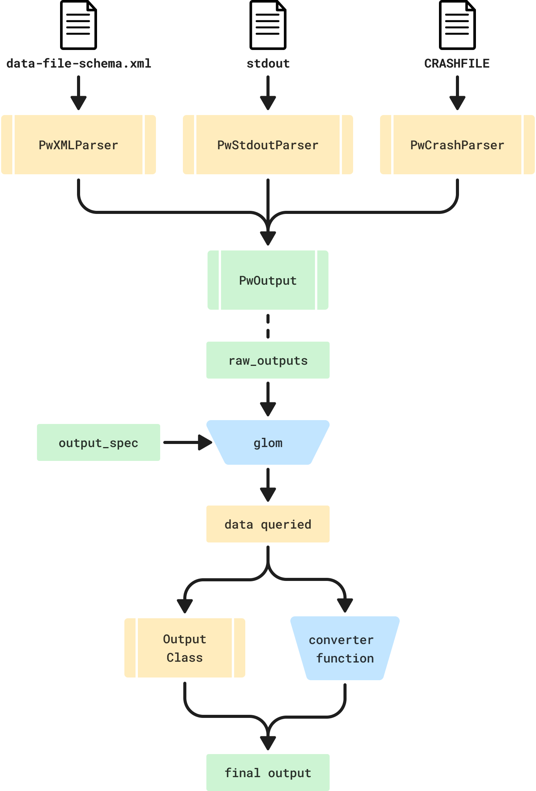

# Outputs

The main purpose of this package is to parse and convert the outputs of Quantum ESPRESSO calculations into Python types.
On this page we discuss the design of the parser functionality.

## Schematic

Below is a rough schematic of how the current implementation works:



## One file, one parser class

All the logic related to parsing (or generating) a file should be stored on one class, with possibly some generic utility methods shared between parser classes.

!!! question "Should the file parser classes be part of the public API?"

    At first, I would have answered "yes" to this question.
    However, if a user can easily find the `pw.x` `stdout` parser, they might use it and then be rather disappointed with the result, since we _want_ to parse most outputs from the XML.

## One output object for each calculation

Parsing one file is typically not enough to get all the outputs of a calculation.
It would be useful to gather all of these into a single "output" object from which the user can access all data they are interested in.

```python
from qe_tools.outputs import PwOutput

qe_dir = '/Users/mbercx/project/qetools/data/qe_dir'

pw_out = PwOutput.from_dir(qe_dir)
pw_out.outputs
```

## Raw output

For any data in the XML, writing a parsers seems _easy_.
Use the `xmlschema` package to parse (and validate) the data, get a dictionary, and done!

However, the "raw" outputs of the XML are perhaps not the most user friendly.
Just try executing the following code for the `PwOutput`:

```
from qe_tools.outputs import PwOutput

qe_dir = '/Users/mbercx/project/qetools/data/qe_dir'

pw_out = PwOutput.from_dir(qe_dir)
pw_out.raw_outputs
```

The `raw_outputs` are massive, and in a format that most users won't understand.

## Querying JSON

Instead, we want to extract and present the outputs that most users care about: structure, Fermi energy, forces, etc.
However, we want to make sure that:

1. it is very clear from which raw output data the final output is parsed.
2. the logic of how a final output is parsed as _localized_ as possible (to borrow a phrase from quantum mechanics).
3. we avoid having to guard against the absence of certain keys with massive `get(value, {})` links.

In order to do this, we decided to look for a "JSON querying" tool, that allows us to quickly, robustly and with a few lines of code extract the data we are interested in.
After doing a bit of research, we decided to give [`glom`](https://glom.readthedocs.io/en/latest/index.html) a try.
As a basic example, take the Fermi energy:

```
from glom import glom

glom(pw_out.raw_outputs, {'fermi_energy': 'xml.output.band_structure.fermi_energy'})
```

This will return a dictionary: `{'fermi_energy': 0.04425026484437661}`.
The idea is that every output has one key-value pair in an `output_mapping` dictionary:

```python
output_mapping = {
    <output_name: str>: (<output_class>, <glom_spec>),
    ...
}
```

For example:

```python
output_mapping = {
    'fermi_energy': (float, 'xml.output.band_structure.fermi_energy')
}
```

## Extending to other tools

Another goal is to be able to convert the outputs into formats of well-known packages in the community (AiiDA, ASE, pymatgen, ...).
Some goals here:

- We want to be able to specify tool-agnostic defaults and then override them.
- Again: we want all the parser logic of one output to be as localized as possible.
- All tools should be optional dependencies defined as extras.

For this we need several steps:

1. Extraction from the (complicated) `raw_outputs`.
2. Conversion into the right units (bonus: ability to add units with `pint`).
3. Conversion into the object corresponding to the output in each tool.

For this, we implement a `BaseConverter` class that:

1. Specifies defaults for _all_ supported outputs, which are _basic Python types_.
2. Organizes these defaults in a `output_mapping` class variable.
3. Implements basic methods for extracting outputs shared by all converter classes.

For each supported tool, we then provide a child class that inherits from `BaseConverter` (e.g. `AiiDAConverter`).
This class can define its own `output_mapping`, and _should_ merge that with the parent one.

For classes that can be entirely constructed via their constructor (`__init__` method), we can define the corresponding `output_mapping` value as a `(<output_class>, <glom_spec>)` tuple.
For example:

```python
class PymatgenConverter(BaseConverter):
    output_mapping = BaseConverter.output_mapping | {
        "structure": (
            Structure,
            {
                "species": (
                    "xml.output.atomic_species.species",
                    [lambda species: re.sub(r"\d+", "", species["@name"][:2])],
                ),
                "lattice": (
                    "xml.output.atomic_structure.cell",
                    lambda cell: CONSTANTS.bohr_to_ang
                    * np.array([cell["a1"], cell["a2"], cell["a3"]]),
                ),
                "coords": (
                    "xml.output.atomic_structure.atomic_positions.atom",
                    [lambda atom: CONSTANTS.bohr_to_ang * np.array(atom["$"])],
                ),
            },
        ),
    }
```

However, if this is not the case, the output cannot be directly constructed with this approach.
An example here is AiiDA's `StructureData`.
This points to poor design of this class' constructor, but we can still support the class by allowing the first element in the now `(<output_converter>, <glom_spec>)` tuple to be a function.

## User interface

A `get_output` method is implemented on the `PwOutput`, which is the main user-facing interface for all these features.
Example usage:

```python
from qe_tools.outputs import PwOutput

pw_out = PwOutput.from_dir('/path/to/qe_dir')
pw_out.get_output('fermi_energy')
```

!!! note
    Having a string as an input is not the most user-friendly, as it suffers from the following issues:

    1. How to know which properties there are?
    2. No tab-completion makes me a sad panda.

    These issues will be addressed in future work.

## Custom spec

!!! question

    What if the user wants more outputs?

In order to give users more power and freedom to users, we want them to be able to write their own custom spec to get the outputs they are interested in.
Note that they could already do this quite easily:

```
from glom import glom

glom(pw_out.raw_outputs, 'xml.output.magnetization.absolute')
```

But in order to make this _even more_ accessible, we add a `BaseOutput.get_output_from_spec()` method:

```
pw_out.get_output_from_spec('xml.output.magnetization.absolute')
```

Which does _exactly_ the same thing.

## Other codes than `pw.x`:

!!! question

    How to support multiple "raw" outputs, i.e. for the various codes (`projwfc.x`, `ph.x`, ...)?

I think separate converter classes may be necessary?
They should have different outputs in any case.
