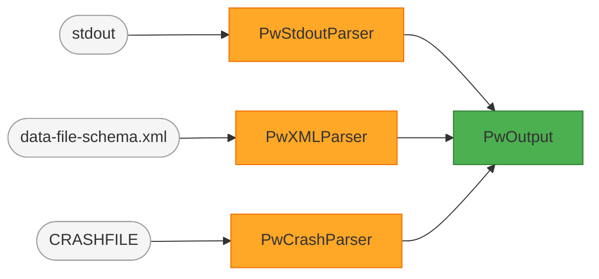

# Outputs

`qe-tools` builds on the generic output machinery from [`dough`](https://github.com/mbercx/dough): base file parsers, the `BaseOutput` class, the `@output_mapping` declaration, and converters all live there.
For the design rationale of those building blocks (parser shape, glom-based extraction, conversion to ASE/pymatgen/AiiDA, the `outputs` namespace, etc.) see the [dough outputs design notes](https://mbercx.github.io/dough/design/outputs/).

This page covers what is **specific to Quantum ESPRESSO**: which classes exist, how they map onto QE's binaries and output files, and the conventions we apply on top of the generic machinery.

## Per-binary output classes

Each QE binary (`pw.x`, `cp.x`, `dos.x`, ...) gets its own output class (`PwOutput`, `CpOutput`, `DosOutput`, ...) in `qe_tools.outputs`.
Each such class relies on one or more file parser classes to generate the "raw outputs", which are then exposed to users via more digestible "base outputs".

The diagram below shows the structure for `pw.x`.


```mermaid
flowchart LR
    classDef io fill:#4caf50,stroke:#2e7d32
    classDef parser fill:#ffa726,stroke:#ef6c00
    classDef file fill:#f5f5f5,stroke:#9e9e9e

    STD([stdout]):::file --> SP[PwStdoutParser]:::parser
    XML([data-file-schema.xml]):::file --> XP[PwXMLParser]:::parser
    CRASH([CRASHFILE]):::file --> CP[PwCrashParser]:::parser
    SP --> PWOUT[PwOutput]:::io
    XP --> PWOUT
    CP --> PWOUT
```

!!! note "XML-first policy"

    Ideally, all outputs would come from the XML — it is structured, validated, and versioned.
    In practice, many quantities are still missing from the QE XML schema, so a stdout parser fills the gaps.
    We always look for an output in the XML first at the implementation stage: only when the quantity is absent from the XML do we implement parsing on the `StdoutParser`.
    As such, the functionality of the `StdoutParser` is limited by design.

## Units

QE writes XML output in Hartree atomic units and stdout output in Rydberg atomic units.
**Parsers are unit-agnostic**: they return the raw QE values with no conversion.
All unit conversions live in the extraction `Spec` of the corresponding mapping field, using the `CONSTANTS` object exported from `qe_tools`:

```python
from typing import Annotated
from glom import Spec
from qe_tools import CONSTANTS

@output_mapping
class _PwMapping:
    total_energy: Annotated[
        float,
        Spec(("xml.output.total_energy.etot", lambda e: e * CONSTANTS.hartree_to_ev)),
    ]
    """Total energy in eV."""
```

The documented units of every output (eV, Å, GPa, 1/Å, ...) are stated in the field's docstring.
`CONSTANTS` represents the constants defined internally by Quantum ESPRESSO.

## Schemas

XML parsers validate against the QE XML schemas shipped under `src/qe_tools/outputs/parsers/schemas/`.
These are vendored copies of the upstream QE `qexsd` schemas, version-pinned to the QE releases we target.
When a new QE version changes the schema, drop the new `.xsd` into that directory and update the parser to dispatch on the schema version where needed.

## Custom outputs and units summary

For QE-specific outputs not yet covered by a `Spec`, users can fall back to `get_output_from_spec()` against `raw_outputs` (XML in Hartree, stdout in Rydberg — convert manually).
For first-class support, add a field to the corresponding `_*Mapping` class with a `Spec` that returns the documented unit.
