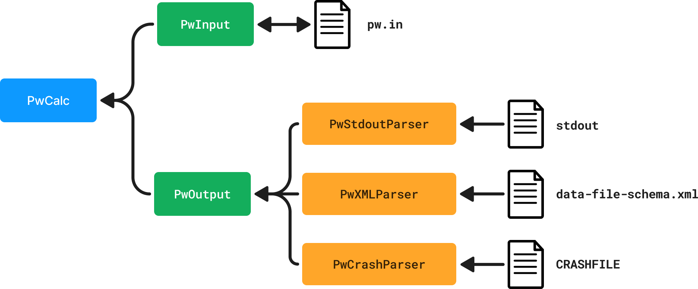

# Quick notes

A place to write down quick notes on the design decisions made for the `qe-tools` package.

!!! note

    The purpose of these notes are to sketch ideas, not write design decisions down rigorously.

## Class structure

The currently envisioned class structure is shown in the sketch below, for the `pw.x` calculation:



### One file, one parser class

This just makes the most sense.
All the logic related to parsing (or generating) a file should be stored on one class, with possibly some generic utility methods shared between parser classes.

!!! question "Should the file parser classes be part of the public API?"

    At first, I would have answered "yes" to this question.
    However, if a user can easily find the `pw.x` `stdout` parser, they might use it and then be rather disappointed with the result, since we _want_ to parse most outputs from the XML.

### One output object for each calculation

Parsing one file is typically not enough to get all the outputs of a calculation.
It would be useful to gather all of these into a single "output" object from which the user can access all data they are interested in.

```python
from qe_tools.outputs import PwOutput

qe_dir = '/Users/mbercx/project/qetools/data/qe_dir'

pw_out = PwOutput.from_dir(qe_dir)
pw_out.outputs
```

## One input per code

Typically, each executable in the Quantum ESPRESSO suite will have a single input file.

The input class should allow for several use cases:

1. Generate a Quantum ESPRESSO input file from various Python types.
2. Parse an existing input file into various Python types.

!!! question "How about "intermediate" files?"

    Some files can be both an output and an input of a calculation.
    Examples here are restart files such as the charge density/wave functions, but those are full (sometimes binary system-specific) files that don't require a Python object to represent.
    Other examples are the interatomic constants, for which we already have [an AiiDA data node](https://github.com/aiidateam/aiida-quantumespresso/blob/main/src/aiida_quantumespresso/data/force_constants.py).

## ASE/`pymatgen`/AiiDA/... support

Most users will want to provide e.g. the input structure or output data in the flavour of their choosing.
We should provide tools for converting:

1. The flavored Python types (`Structure`, `Atoms`, ...) into the Quantum ESPRESSO input file.
2. The Quantum ESPRESSO raw parsed output into the flavour's Python type.

## One class to rule both input/output

!!! question "Would it instead not be useful to have one object that has both inputs and outputs?" 

    Reasons could be:

    1. The user might want to just load both input/output from the directory in one fell swoop, since they might want to work with the output of the calculation differently depending on the input.
    2. Some parsing functionality might be easier to implement if the inputs are known.
    I think it may even be necessary for some outputs to know e.g. what the number of k-points are. Some of the inputs are also in the XML output though...

**Example Usage**

If you want to parse all the inputs and outputs from a `pw.x` run in the `pw_run` directory:

```
from qe_tools.parsers import PwParser

parser = PwParser.from_dir('pw_run')
```

Then you can obtain the outputs as

```
parser.outputs['structure']
```

similarly, the inputs can then be obtained from the `inputs` attribute:

```
parser.inputs['structure']
```

(Maybe this should not be a "parser", but a "calculation". E.g. `PwCalc` that has `inputs` and `outputs`.)

## Units

Make separate module with chosen units in one place: consistent throughout package.
Add units with `pint`: make optional dependency?
We have to check how heavy the package is, and how complicated the code would be to make it optional.

## Specific notes

* Kind names have to be element + digits for parsing to work. In principle you can name a kind _anything_, but we don't want to support that...
